# QShing Guard 🛡️
**Quishing (QR Phishing) Detection Framework**  
*Developed by Hynix-Brain Team*

✦ Real‑world augmentation ✦ Multi‑modal fusion ✦ Security‑game co‑evolution (Context Attacker ↔ Detector)


> **Mission**: Build an operational pipeline that **detects (WARN) and blocks (BLOCK)** QR‑enabled phishing attacks (“Quishing”).  
> **Core idea**: Under **decodability constraints** (QR must remain scannable), train for robustness against both **real‑world capture distribution** and **adversarial context attacks**.

---

## TL;DR
- **Real‑world Data Augmentation**: simulate “in‑the‑wild” QR captures with `QR + Background + Camera/Sharing Effects`
- **Fusion Detector**: QR image + URL text (TF‑IDF) + URL lexical features + context feature branch
- **Security‑game Co‑evolution**: attacker generates what the detector fails on; the detector absorbs current + past attacks via replay
- **Operationalization**: FPR‑based `WARN/BLOCK` thresholds + calibration + reports (ROC/PR/CM/Calibration/ECE)

---

## Table of Contents
- [1. Why Quishing is Dangerous](#1-why-quishing-is-dangerous)
- [2. End-to-End Pipeline](#2-end-to-end-pipeline)
- [3. Real-world Data Augmentation](#3-real-world-data-augmentation)
- [4. Fusion Model](#4-fusion-model)
- [5. Security Game Co-evolution](#5-security-game-co-evolution)
- [6. Quickstart](#6-quickstart)
- [7. Training & Evaluation](#7-training--evaluation)
- [8. Demo](#8-demo)
- [9. Expected Impact & Roadmap](#9-expected-impact--roadmap)
- [10. Reproducibility Notes](#10-reproducibility-notes)
- [Disclaimer](#disclaimer-️)

---

## 1) Why Quishing is Dangerous
**Quishing** uses QR scanning as the trigger to deliver a malicious URL into a browser/app.  
Because users often do not “see” a link before scanning, a single scan can lead directly to redirects, landing pages, and credential theft.

### Threat highlights
- **Delayed user awareness**: QR scan can open apps/URLs immediately, before any human verification
- **Easy propagation**: posters, documents, receipts, payment screens, and other offline channels
- **Low-cost evasions**: attackers can keep the code scannable while perturbing capture conditions (blur, JPEG artifacts, occlusion, perspective)

> QShing Guard is not “QR content only.” It is an operational design that explicitly targets **real-world distribution shift + metrics + adversarial training**.

---

## 2) End-to-End Pipeline
QShing Guard provides an end‑to‑end pipeline from dataset construction to operational evaluation and demo.

### 2.1 Pipeline Diagram (Mermaid)
> Automatically rendered on GitHub.

```mermaid
flowchart TD
  A["Raw DB<br/>KISA (phish URL)<br/>Kakao (labeled)<br/>Normal URLs"] --> B["Build Manifest<br/>normalize / dedup / balance"]
  B --> C["Split<br/>(domain-level recommended)"]
  C --> D["Generate Clean QR<br/>URL → QR image"]
  D --> E["Attach QR Paths<br/>train/val/test_with_qr.csv"]
  E --> F["Real-world Augmentation<br/>on-the-fly or offline<br/>QR + BG + camera effects"]
  F --> G["Baselines<br/>URL / QR / Fusion"]
  G --> H["Security Game Co-evolution<br/>Attacker ↔ Detector<br/>(pool + replay + scaling)"]
  H --> I["Operational Eval<br/>WARN/BLOCK + calibration<br/>robustness curve"]
  I --> J["Demo<br/>10–20 QRs<br/>panel visualization"]
```



### 2.2 Code Map (key modules)
- `src/qr/augmentations.py` : real‑world augmentation + QR/background composition
- `src/train/modeling_qr.py` : QR detector backbone
- `src/train/modeling_fusion.py` : fusion detector (gated/concat) + optional context branch
- `src/train/train_coevolution.py` : co‑evolution loop (attacker pool, replay, difficulty scaling)
- `src/eval/*` : operational evaluation + visual reports (ROC/PR/CM/Calibration/ECE)
- `src/app/*` : demo inference + panel visualization

---

## 3) Real-world Data Augmentation
Training on clean, synthetic QR images alone is not enough: performance often degrades on **in‑the‑wild captures**.  
QShing Guard simulates context/background and camera/sharing artifacts explicitly.

### 3.1 Context-aware Background Composition
Composition: **QR + Background + Camera/Sharing Effect**  
Backgrounds are label‑agnostic to avoid leakage/bias.

Recommended directory:
```text
assets/
└── backgrounds/
    ├── document/
    ├── poster/
    ├── receipt/
    └── screen/
```

Key options:
- `--background_dir assets/backgrounds`
- `--context_mode mix`
- `--context_prob 0.75`
- `--output_size 512`

### 3.2 Camera/Sharing Effects
- perspective warp, blur, brightness/contrast, JPEG artifacts (messenger sharing), noise, occlusion (hands/stickers)

### 3.3 Context Feature Branch
Not “content embedding,” but **scene/context metadata** used as structured features for fusion.

| Feature | Meaning |
|---|---|
| `qr_area_ratio` | QR size relative to image |
| `qr_x, qr_y` | normalized QR position |
| `blur_score` | capture/print quality proxy |
| `contrast` | print contrast proxy |
| `bg_complexity` | background complexity (edge density) |
| `occlusion_ratio` | occlusion/decay proxy |

Enable with `--use_context` in fusion training.

---

## 4) Fusion Model
In production, fusion is critical: sometimes the QR visual signal is weak, in which case URL, lexical, and contextual features compensate; in other cases, the URL is short or obfuscated, and QR visual cues and contextual signals provide the necessary evidence. By design, each modality offsets the failure modes of the others, enabling robust detection under real-world noise and adversarial conditions.

### 4.1 Architecture Diagram (Mermaid)


### 4.2 Fusion Modes
- `gated` (**recommended**): dynamically gates contributions from QR/URL/lex/context
- `concat`: simple concatenation baseline

---

## 5) Security Game Co-evolution
Not a generic GAN: this is a **security game** loop.

- **Attacker (Context Attacker)**: crafts context attacks that maximally confuse the current detector
- **Detector (Defense)**: trains on clean + current attacks + replayed past attacks to prevent forgetting
- **Difficulty Scaling**: weak → realistic → optimal

### 5.1 Co-evolution Diagram (Mermaid)


### 5.2 Stabilization Techniques (important)
- **Attacker Pool**: maintain multiple attackers → defend against an ensemble
- **Replay Buffer**: reuse past attacks → mitigate catastrophic forgetting
- **Decodability / Payload Constraints**
  - `--decode_filter`: train only on samples that decode successfully
  - `--payload_match`: enforce decoded payload == ground truth (`url_norm`)
    - recommended after warm‑up for stable convergence

---

## 6) Quickstart
> 💡 Prefer an interactive walkthrough?  
> You can also follow the step-by-step Jupyter notebooks in `notebooks/notebooks_guide` alongside this Quickstart.

### Requirements
- Python 3.10+ recommended
- (Optional) CUDA for faster training

### Install
```bash
pip install -r requirements.txt
```

### STEP 1) Build manifest (fast smoke test)
```bash
python -m src.data.build_manifest \
  --kisa_csv data/raw/kisa_db.csv \
  --kakao_csv data/raw/kakao_db.csv \
  --normal_csv data/raw/normal_urls.csv \
  --normal_limit 2000 \
  --phish_limit 2000 \
  --balance_ratio 1.0 \
  --dedup_by_url_norm \
  --out_dir data/processed \
  --seed 42
```

### STEP 2) Create splits (reduce leakage)
```bash
python -m src.data.split_manifest \
  --manifest_csv data/processed/manifest.csv \
  --out_dir data/processed \
  --seed 42
```

### STEP 3) Generate QRs (URL → QR)
```bash
python -m src.qr.generate_qr \
  --manifest_path data/processed/manifest.csv \
  --out_dir data/qr_images \
  --update_manifest_out data/processed/manifest_with_qr.csv \
  --ecc H \
  --box_size 10 \
  --border 4
```

### STEP 4) Attach QR paths to split CSVs
```bash
python -m src.data.attach_qr_paths \
  --manifest_with_qr data/processed/manifest_with_qr.csv \
  --splits_dir data/processed \
  --out_dir data/processed
```

### STEP 5) (Optional) Build offline real‑world augmented dataset
```bash
python -m src.qr.augment_qr \
  --input_dir data/qr_images \
  --out_dir data/qr_images_aug \
  --n_per_image 2 \
  --strength strong \
  --background_dir assets/backgrounds \
  --context_mode mix \
  --context_prob 0.75 \
  --output_size 512 \
  --decode_filter \
  --save_meta_csv data/processed/qr_aug_meta.csv \
  --seed 42
```

---

## 7) Training & Evaluation
### Fusion baseline (recommended)
```bash
python -m src.train.train_fusion \
  --train_csv data/processed/train_with_qr.csv \
  --val_csv data/processed/val_with_qr.csv \
  --test_csv data/processed/test_with_qr.csv \
  --out_dir artifacts/models/fusion \
  --fusion_mode gated \
  --augment_strength strong \
  --use_context \
  --balance_sampler \
  --warn_fpr 0.01 \
  --block_fpr 0.001
```

### Co-evolution (recommended, 2-stage)
**(A) Warm-up: `decode_filter` only**
```bash
python -m src.train.train_coevolution \
  --train_csv data/processed/train_with_qr.csv \
  --val_csv data/processed/val_with_qr.csv \
  --out_dir artifacts/models/coevo_fusion_warmup \
  --detector_mode fusion \
  --fusion_mode gated \
  --use_context \
  --background_dir assets/backgrounds \
  --rounds 3 \
  --attacker_pool 3 \
  --k_attack 10 \
  --k_defense 50 \
  --batch_size 64 \
  --image_size 224 \
  --balance_sampler \
  --decode_filter \
  --decode_subset 16 \
  --decode_resample 3 \
  --decode_min_keep 4
```

**(B) Main game: enforce `payload_match`**
```bash
python -m src.train.train_coevolution \
  --train_csv data/processed/train_with_qr.csv \
  --val_csv data/processed/val_with_qr.csv \
  --out_dir artifacts/models/coevo_fusion_payload \
  --detector_mode fusion \
  --fusion_mode gated \
  --use_context \
  --background_dir assets/backgrounds \
  --rounds 10 \
  --attacker_pool 3 \
  --k_attack 10 \
  --k_defense 50 \
  --batch_size 64 \
  --image_size 224 \
  --balance_sampler \
  --decode_filter \
  --payload_match \
  --payload_col url_norm \
  --decode_subset 16 \
  --decode_resample 3 \
  --decode_min_keep 4
```

### Operational evaluation (WARN/BLOCK) + visualization
```bash
python -m src.eval.eval_fusion_operational \
  --val_csv data/processed/val_with_qr.csv \
  --test_csv data/processed/test_with_qr.csv \
  --model_dir artifacts/models/fusion \
  --out_dir artifacts/reports/fusion_eval \
  --warn_fpr 0.01 \
  --block_fpr 0.001 \
  --fit_temperature_on_val
```

---

## 8) Demo (10–20 inputs → decisions + panels)
```bash
python -m src.app.demo_qr_predict \
  --input_dir samples/qr_demo \
  --ckpt artifacts/models/qr/best.pt \
  --thresholds_json artifacts/reports/qr_eval/thresholds.json \
  --out_dir artifacts/demo/qr_run1 \
  --save_panel
```

---

## 9) Expected Impact & Roadmap
### Expected impact
- **Faster response to emerging quishing campaigns** with operational WARN/BLOCK actions
- **Higher robustness** under capture/printing/sharing artifacts
- **Lower ops burden** via FPR‑controlled thresholds + calibration
- **Continuous hardening** via co‑evolution against new evasions

### Roadmap
- Expand background library by domain (banking/delivery/public sector, etc.)
- Strengthen payload‑preserving constraints (partial scans, multi‑QR scenes, redirect chains)
- Multi‑channel inputs (message body/sender/metadata) for richer multi‑modal defense
- MLOps integration: drift detection + robustness monitoring dashboard

---

## 10) Reproducibility Notes
- **Splits**: prefer **domain‑level** splits over URL‑level to reduce leakage.
- **Thresholds (WARN/BLOCK)**: set `--warn_fpr` and `--block_fpr` to match operational tolerance; use temperature scaling on validation when possible (`--fit_temperature_on_val`).
- **Decode constraints**: for co‑evolution, strengthen constraints gradually: `decode_filter` → `payload_match`.

---

## Disclaimer ⚠️
This repository is for **defensive research and protection** against QR‑phishing. Any offensive use is prohibited. Follow all applicable laws, policies, and ethical guidelines when using datasets and models.
