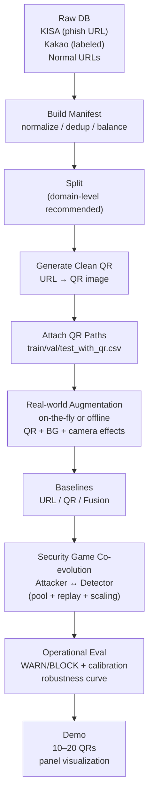
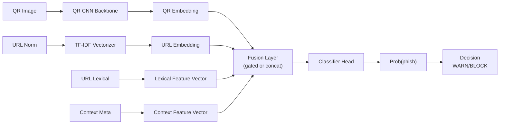
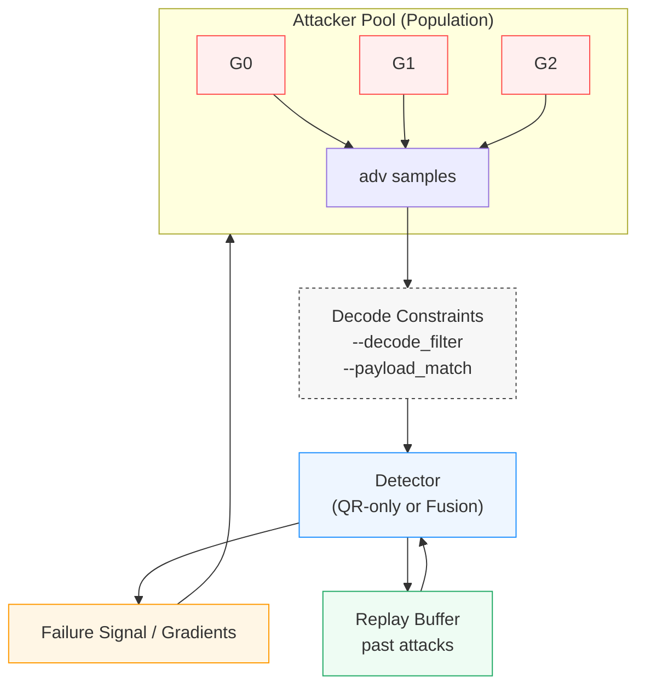

# QShing Guard 🛡️
**Quishing(큐싱/QR 피싱) 탐지 프레임워크**  
Real‑world 증강 ✦ Fusion detector ✦ Security‑game co‑evolution (Context Attacker ↔ Detector)


> **목표(Mission)**: QR 코드를 악용한 신종 피싱(큐싱/Quishing)을 **탐지(WARN)·차단(BLOCK)** 하는 운영형 모델/파이프라인 구축  
> **핵심(Core idea)**: “스캔 가능한 QR(Decodability)” 제약 하에서 **현실 촬영 분포(Real‑world capture distribution)** + **적대적 Context 공격**에도 무너지지 않는 강건성(robustness) 확보

---

## TL;DR
- **Real‑world Data Augmentation**: `QR + Background + Camera/Sharing Effects`로 **현장 촬영본 같은 분포**를 학습
- **Fusion Detector**: QR 이미지 + URL 문자열(TF‑IDF) + URL lexical + Context feature branch
- **Security‑game Co‑evolution**: 공격자(Attacker)가 “가장 잘 속는” 공격을 만들고, 방어자(Detector)는 이를 흡수하며 강해지는 **순환 적대 학습 루프**
- **운영 설계(Operational)**: FPR 기반 `WARN/BLOCK` 임계값 + calibration + 시각화 리포트(ROC/PR/CM/Calibration/ECE)

---

## 목차
- [1. 왜 큐싱이 위험한가](#1-왜-큐싱이-위험한가)
- [2. End-to-End 파이프라인](#2-end-to-end-파이프라인)
- [3. Real-world Data Augmentation](#3-real-world-data-augmentation)
- [4. Fusion Model](#4-fusion-model)
- [5. Security Game Co-evolution](#5-security-game-co-evolution)
- [6. Quickstart](#6-quickstart)
- [7. Training & Evaluation](#7-training--evaluation)
- [8. Demo](#8-demo)
- [9. 기대효과 및 향후 확장성](#9-기대효과-및-향후-확장성)
- [10. 재현성(실험) 노트](#10-재현성실험-노트)
- [Disclaimer](#disclaimer-️)

---

## 1) 왜 큐싱이 위험한가
**Quishing(큐싱/퀴싱)** 은 QR 코드 스캔을 트리거로 사용자의 브라우저/앱으로 악성 URL을 전달하는 피싱 기법입니다.  
“링크를 클릭했다”는 인지 없이 **스캔 1번으로 즉시 이동**하기 때문에, 탐지·차단 타이밍이 늦으면 피해로 직결됩니다.

### 위협 포인트
- **사용자 인지 지연**: 링크 텍스트를 보기 전에 앱이 열리고 리다이렉트/랜딩이 진행될 가능성 농후
- **전파 용이**: 전단/포스터/문서/영수증/결제 화면 등 오프라인 채널을 통해 빠르게 확산
- **탐지 우회 비용이 낮음**: 공격자는 “스캔 가능”을 유지한 채, 촬영 환경/배경/열화(blur, jpeg, occlusion, perspective)로 탐지기를 흔들 가능성 다분

> QShing Guard는 “QR 내용만” 보는 모델이 아니라, **현실 촬영 분포 + 운영 지표 + 적대 학습**까지 포함한 운영형 설계를 목표로 합니다.

---

## 2) End-to-End 파이프라인
QShing Guard는 데이터 구축부터 운영형 평가/데모까지 **하나의 파이프라인**으로 제공합니다.

### 2.1 Pipeline Diagram (Mermaid)
> GitHub에서 자동 렌더링됩니다.



### 2.2 Code Map (핵심 파일)
- `src/qr/augmentations.py` : 현실 촬영 증강 + QR+Background 합성
- `src/train/modeling_qr.py` : QR detector backbone
- `src/train/modeling_fusion.py` : Fusion detector (gated/concat) + context feature branch
- `src/train/train_coevolution.py` : Security‑game co‑evolution 루프(attacker pool, replay, difficulty scaling)
- `src/eval/*` : 운영 지표 평가 + 시각화(ROC/PR/CM/Calibration/ECE 등)
- `src/app/*` : 데모 예측 + 패널 시각화

---

## 3) Real-world Data Augmentation
디지털로 생성한 “깨끗한 QR”만으로는 **현장 촬영본**에서 성능이 크게 흔들릴 수 있습니다.  
QShing Guard는 **컨텍스트(배경) + 카메라/공유 열화**를 명시적으로 시뮬레이션합니다.

### 3.1 Context‑aware Background Composition
구조: **QR + Background + Camera/Sharing Effect**  
배경은 URL/라벨과 무관한 이미지로만 구성하여(데이터 누수/편향 방지), “상황” 변화에 대한 일반화를 강화합니다.

권장 디렉터리:
```text
assets/
└── backgrounds/
    ├── document/
    ├── poster/
    ├── receipt/
    └── screen/
```

주요 옵션:
- `--background_dir assets/backgrounds`
- `--context_mode mix`
- `--context_prob 0.75`
- `--output_size 512`

### 3.2 Camera/Sharing Effects (촬영·공유 환경)
- perspective(사선 촬영), blur(초점 문제), brightness/contrast, JPEG artifact(메신저 공유), noise, occlusion(손/스티커/가림)

### 3.3 Context Feature Branch (상황 특징)
QR “이미지 embedding”이 아니라, QR이 놓인 **상황들(Context)** 을 수치화해 Fusion에 주입합니다.

| Feature | 의미 |
|---|---|
| `qr_area_ratio` | 전체 이미지 대비 QR 크기 |
| `qr_x, qr_y` | QR 위치(정규화) |
| `blur_score` | 촬영/인쇄 품질 proxy |
| `contrast` | 인쇄 대비 |
| `bg_complexity` | 배경 복잡도(edge density) |
| `occlusion_ratio` | 가림/열화 proxy |

> Fusion 모델에서 `--use_context`로 활성화합니다.

---

## 4) Fusion Model
운영에서 가장 중요한 포인트는 Fusion 입니다.
QR 이미지 신호가 약할 때는 URL·lexical·context 정보가 이를 보완하고, 반대로 URL 문자열이 짧거나 난독화된 경우에는 QR 이미지 및 컨텍스트 정보가 판단력을 보강합니다. 즉, 단일 신호에 의존하지 않고 각 모달리티가 상호보완적으로 작동하는 다중 증거 기반 탐지 구조가 운영 안정성과 탐지 신뢰도를 동시에 확보하는 핵심입니다.

### 4.1 Architecture Diagram (Mermaid)


### 4.2 Fusion Modes
- `gated` (**권장**): QR/URL/lex/context 기여도를 게이팅으로 동적 조절  
- `concat`: 단순 결합(기준선)

---

## 5) Security Game Co-evolution
단순 GAN이 아니라, **보안 게임(Security Game)** 관점의 순환 적대 학습입니다.

- **Attacker (Context Attacker)**: 현재 Detector가 “가장 잘 속는” 컨텍스트 공격을 생성
- **Detector (Defense)**: Clean + Current Attack + Past Attacks(replay)를 함께 학습하여 안정적 분류 유지
- **Difficulty Scaling**: weak → realistic → optimal로 점진적 난이도 증가

### 5.1 Co-evolution Diagram (Mermaid)


### 5.2 안정화 기법 (중요)
- **Attacker Pool**: 공격자 1개가 아니라 N개를 유지 → detector는 공격 ensemble을 상대
- **Replay Buffer**: 과거 공격 재사용 → forgetting/defense collapse 방지
- **Decodability / Payload Constraint**
  - `--decode_filter`: decode 성공 샘플만 학습
  - `--payload_match`: decode payload == GT(`url_norm`) 일치까지 강제  
    - 권장: 워밍업 이후에 활성화(초기 학습 수렴 안정화)

---

## 6) Quickstart
> 💡 CLI 실행이 익숙하지 않다면  
> `notebooks/notebooks_guide`의 Jupyter Notebook을 참고하며 단계별로 따라가도 좋습니다.

### Requirements
- Python 3.10+ 권장
- (선택) CUDA 환경에서 학습 가속 가능

### Install
```bash
pip install -r requirements.txt
```

### STEP 1) Manifest 구축 (Fast Test)
```bash
python -m src.data.build_manifest   --kisa_csv data/raw/kisa_db.csv   --kakao_csv data/raw/kakao_db.csv   --normal_csv data/raw/normal_urls.csv   --normal_limit 2000   --phish_limit 2000   --balance_ratio 1.0   --dedup_by_url_norm   --out_dir data/processed   --seed 42
```

### STEP 2) Split 생성 (Leakage 방지)
```bash
python -m src.data.split_manifest   --manifest_csv data/processed/manifest.csv   --out_dir data/processed   --seed 42
```

### STEP 3) QR 생성 (URL → QR)
```bash
python -m src.qr.generate_qr   --manifest_path data/processed/manifest.csv   --out_dir data/qr_images   --update_manifest_out data/processed/manifest_with_qr.csv   --ecc H   --box_size 10   --border 4
```

### STEP 4) QR 포함 split 생성
```bash
python -m src.data.attach_qr_paths   --manifest_with_qr data/processed/manifest_with_qr.csv   --splits_dir data/processed   --out_dir data/processed
```

### STEP 5) Offline Real-world Aug dataset 생성 (선택)
```bash
python -m src.qr.augment_qr   --input_dir data/qr_images   --out_dir data/qr_images_aug   --n_per_image 2   --strength strong   --background_dir assets/backgrounds   --context_mode mix   --context_prob 0.75   --output_size 512   --decode_filter   --save_meta_csv data/processed/qr_aug_meta.csv   --seed 42
```

---

## 7) Training & Evaluation
### Fusion Baseline (권장)
```bash
python -m src.train.train_fusion   --train_csv data/processed/train_with_qr.csv   --val_csv data/processed/val_with_qr.csv   --test_csv data/processed/test_with_qr.csv   --out_dir artifacts/models/fusion   --fusion_mode gated   --augment_strength strong   --use_context   --balance_sampler   --warn_fpr 0.01   --block_fpr 0.001
```

### Co-evolution (권장 2단계)
**(A) 워밍업: `decode_filter`만**
```bash
python -m src.train.train_coevolution   --train_csv data/processed/train_with_qr.csv   --val_csv data/processed/val_with_qr.csv   --out_dir artifacts/models/coevo_fusion_warmup   --detector_mode fusion   --fusion_mode gated   --use_context   --background_dir assets/backgrounds   --rounds 3   --attacker_pool 3   --k_attack 5   --k_defense 100   --batch_size 64   --image_size 224   --balance_sampler   --decode_filter   --decode_subset 16   --decode_resample 3   --decode_min_keep 4
```

**(B) 본게임: `payload_match`까지 강제**
```bash
python -m src.train.train_coevolution   --train_csv data/processed/train_with_qr.csv   --val_csv data/processed/val_with_qr.csv   --out_dir artifacts/models/coevo_fusion_payload   --detector_mode fusion   --fusion_mode gated   --use_context   --background_dir assets/backgrounds   --rounds 15   --attacker_pool 3   --k_attack 5   --k_defense 100   --batch_size 64   --image_size 224   --balance_sampler   --decode_filter   --payload_match   --payload_col url_norm
```

### Operational Evaluation (WARN/BLOCK) + Visualization
```bash
python -m src.eval.eval_fusion_operational   --val_csv data/processed/val_with_qr.csv   --test_csv data/processed/test_with_qr.csv   --model_dir artifacts/models/fusion   --out_dir artifacts/reports/fusion_eval   --warn_fpr 0.01   --block_fpr 0.001   --fit_temperature_on_val
```

---

## 8) Demo (10~20개 입력 → 판정/시각화)
```bash
python -m src.app.demo_qr_predict   --input_dir samples/qr_demo   --ckpt artifacts/models/qr/best.pt   --thresholds_json artifacts/reports/qr_eval/thresholds.json   --out_dir artifacts/demo/qr_run1   --save_panel
```

---

## 9) 기대효과 및 향후 확장성
### 기대효과
- **신종 큐싱 위협 대응**: QR 기반 피싱을 운영형 지표(WARN/BLOCK)로 즉시 조치 가능
- **실전 강건성 향상**: 촬영/공유/인쇄 환경에서도 성능 저하 최소화
- **운영 비용 절감**: FPR 기반 임계값 + calibration으로 오탐 억제
- **지속적 방어력 향상**: co‑evolution으로 새로운 우회 패턴에 반복 적응

### 향후 확장성
- **Background Library 확장**: 업종/상황별 배경 추가(은행/배송/관공서 등)
- **Payload-preserving 제약 강화**: 부분 스캔/멀티 QR/리다이렉트 체인까지 확장
- **Multi-channel 입력**: 메시지 본문/발신자/메타데이터 결합(멀티모달)
- **MLOps 연계**: 드리프트 감지 + robustness curve 모니터링 대시보드

---

## 10) 재현성(실험) 노트
- **Split 권장**: URL 단위가 아니라 **도메인 단위(domain‑level)** split을 권장합니다(데이터 누수 완화).
- **임계값(WARN/BLOCK)**: 운영 환경의 허용 FPR을 기준으로 `--warn_fpr`, `--block_fpr`를 설정하고, 가능하면 validation set에서 temperature scaling을 적용하세요(`--fit_temperature_on_val`).
- **Decode 제약**: co‑evolution 학습 시 `decode_filter` → `payload_match` 순으로 단계적으로 강화하면 안정적입니다.

---

## Disclaimer ⚠️
본 저장소는 **QR 기반 피싱 방어/연구 목적**입니다. 실제 공격/악용은 금지되며, 해당 데이터와 모델들 사용 시 관련 **법규 및 윤리 기준**을 반드시 준수해야합니다.
